  

  

  

    
    
    
  

---

### About

First-year **Computer Engineering** student at **York University** and a full-stack builder. Currently working on **Codessey**, a multi-agent AI code review tool. More at [portfolio-20-two.vercel.app](https://portfolio-20-two.vercel.app/).

---

### Activity

<table><tr><td align="center">

<!-- COMMITS:AUTO:START -->
<table>
<tr><th>When</th><th>Repo</th><th>Commit</th><th>Message</th></tr>
<tr><td>2026-06-25</td><td><a href="https://github.com/AdrianShah/Codessey"><code>Codessey</code></a></td><td><a href="https://github.com/AdrianShah/Codessey/commit/f3df4c821f12204593271b92655c8f8f1a58ba37"><code>f3df4c8</code></a></td><td>fix: rewrote root to index.html on Vercel</td></tr>
<tr><td>2026-06-25</td><td><a href="https://github.com/AdrianShah/Codessey"><code>Codessey</code></a></td><td><a href="https://github.com/AdrianShah/Codessey/commit/f7c671c745b50c86298a807c2500bc28a4d5bd60"><code>f7c671c</code></a></td><td>fix: rewrote root to index.html on Vercel</td></tr>
<tr><td>2026-06-25</td><td><a href="https://github.com/AdrianShah/Codessey"><code>Codessey</code></a></td><td><a href="https://github.com/AdrianShah/Codessey/commit/9438f4e0fcd8e2da92e585b5bb3dc7b557cd1123"><code>9438f4e</code></a></td><td>fix: simplify Vercel config and remove redundant index.html…</td></tr>
</table>
<!-- COMMITS:AUTO:END -->

</td></tr></table>

---

### World Cup 2026 Predictions

Knockout picks live in [`predictions/predictions.yml`](./predictions/predictions.yml).

<!-- PREDICTIONS:AUTO:START -->

<strong>Today's slate (EST): July 4, 2026</strong>

<table>
<tr>
<td align="center" width="40%">
 Morocco
</td>
<td align="center" width="20%"><strong>vs</strong> Round of 16</td>
<td align="center" width="40%">
 Canada
</td>
</tr>
<tr>
<td colspan="3" align="center"><strong>Pick:</strong> Morocco &nbsp;|&nbsp; <strong>Result:</strong> <em>upcoming</em> &nbsp;|&nbsp; -</td>
</tr>
</table>
 
<table>
<tr>
<td align="center" width="40%">
 France
</td>
<td align="center" width="20%"><strong>vs</strong> Round of 16</td>
<td align="center" width="40%">
 Paraguay
</td>
</tr>
<tr>
<td colspan="3" align="center"><strong>Pick:</strong> France &nbsp;|&nbsp; <strong>Result:</strong> <em>upcoming</em> &nbsp;|&nbsp; -</td>
</tr>
</table>
<!-- PREDICTIONS:AUTO:END -->

---

Built with GitHub Actions · <a href="./SETUP.md">Setup notes</a>
  

